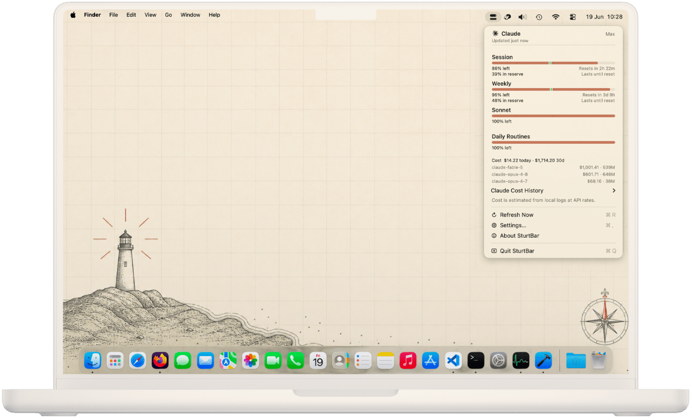

# SturtBar

[](https://github.com/michael-palmes/SturtBar/actions/workflows/ci.yml)
[](https://github.com/michael-palmes/SturtBar/releases/latest)
[](LICENSE)

**The light that watches the passage so you don't run aground.**

SturtBar is a small, calm macOS menu bar app that keeps watch over your Claude Code usage: how much of the current session window is left, how much of the week, when each one resets, and what you have spent. Usage limits are the rocks. Your remaining quota is your sea room. SturtBar keeps the light burning so you always know how much passage you have left.

If you also sail with OpenAI's Codex CLI, SturtBar can keep watch over that coast too. It is strictly **opt-in**: off by default, with both providers stacked in one view when enabled together.

It is named for the Sturt Light at Cape Willoughby, on the eastern tip of Kangaroo Island: South Australia's first lighthouse, first lit on 16 January 1852, watching over Backstairs Passage so ships did not run aground. The light's namesake, as Colonial Secretary, raised the money from shipping interests to build the very light that warned their ships off the rocks. The funder paid for the warning. SturtBar is that light, re-manned by software.

> Note: SturtBar is an independent project. It is not affiliated with, endorsed by, or built by Anthropic. It reads the usage data Claude Code already stores on your Mac.

<p align="center">
  
</p>


## What it shows

- **The Lamp** (the menu bar glyph): a two-bar meter. The tall bar is the session window, the short bar is the week. Each fills from the bottom as usage rises.
- **The Logbook** (the popover): session and weekly windows with exact percentages and reset countdowns, plus your spend for the period.
- **Notices to Mariners**: a rare, useful notification at 75% of a session, at the limit, when it refloats, and as the week draws in. Each is individually toggleable. No streaks, no nags, no re-engagement. A lighthouse does not send push notifications asking if you have thought about it lately.

## How it works

SturtBar reads the credentials Claude Code already keeps on your Mac. It looks first at `~/.claude/.credentials.json`, then falls back to the `Claude Code-credentials` item in your login keychain. It uses those credentials to call the usage API, exactly as Claude Code does. It reads them; it never changes them.

Spend is read locally by scanning the session logs under `~/.claude/projects` (the same JSONL `ccusage` reads): the token counts only, never your prompts or replies. Nothing is uploaded.

Refresh runs on a hybrid schedule: whenever you open the menu, plus a background interval you choose (manual, 1, 2, 5, 15, or 30 minutes; 5 is the default). Cost scans run on demand.

**On token rotation:** if SturtBar ever has to refresh an expired OAuth token, the rotated token is written **only** to SturtBar's own keychain cache. SturtBar never writes to Claude Code's credential stores.

If SturtBar keeps asking you to re-authenticate after you've already logged back into Claude Code, see [TROUBLESHOOTING.md](TROUBLESHOOTING.md): it's usually a keychain-permission or stale-file issue, not a login problem. (Note that signing into the Claude _desktop app_ doesn't update the credentials SturtBar reads; only the `claude` CLI does.)

**Codex (opt-in):** enable the Codex provider in Settings and SturtBar reads the sign-in the codex CLI already keeps at `~/.codex/auth.json` (read-only: SturtBar never writes that file, never refreshes Codex tokens, and never parses the identity token) and calls the same ChatGPT usage endpoint the CLI uses. If you also turn on local cost tracking, it reads the token counts in your `~/.codex` session logs (`sessions` and `archived_sessions`, or the `CODEX_HOME` location if you have set one) to estimate spend locally, exactly as it does for Claude Code: the tallies only, never your prompts or replies, and nothing is uploaded. If the token has expired, SturtBar simply says so and waits for you to run `codex`; it never touches `auth.openai.com`. Disable the provider and its lane goes fully dark again: no reads, no requests, and the cached snapshot is wiped.

## Privacy

**The Keeper watches the water, not you.** SturtBar watches your usage, never you. Your credentials and session logs stay on your Mac; the only signals sent are the ones listed here.

What it reads:

- Claude Code's credentials, read-only: `~/.claude/.credentials.json` first, then the `Claude Code-credentials` login keychain item. It never writes to either.
- Session logs under `~/.claude/projects`, scanned locally for spend estimates. It reads the token counts these logs record, not the prompts or replies in them. Nothing is uploaded.
- Claude Desktop's local agent transcripts, only if you turn on "Include Claude Desktop sessions" (off by default): scanned read-only under `~/Library/Application Support/Claude` for the same token counts. While the setting is off, those folders are never touched.
- Codex's sign-in, read-only: `~/.codex/auth.json`, or the `CODEX_HOME` location if you have set one. Its contents are read only while the Codex provider is enabled. SturtBar never writes it, never refreshes Codex tokens, never parses the identity token, and never calls `auth.openai.com`.
- Codex session logs, read locally for spend estimates only while the Codex provider and cost tracking are both on: scanned under `~/.codex` (`sessions` and `archived_sessions`, or the `CODEX_HOME` location if set), reading the token counts only, not your prompts or replies. Nothing is uploaded.

Every network call it makes:

- `api.anthropic.com/api/oauth/usage`: reads your usage numbers, authenticated with the OAuth token, on each refresh.
- `platform.claude.com/v1/oauth/token`: refreshes the OAuth token, only when a stored token has expired. The rotated token is written only to SturtBar's own keychain cache.
- `chatgpt.com/backend-api/wham/usage`: reads your Codex usage numbers, authenticated with the codex CLI's existing sign-in, on each refresh, only while the Codex provider is enabled.
- `models.dev/api.json`: fetches the pricing catalogue, unauthenticated, at most about once a day, and only while local cost tracking is enabled.

When the Claude session expires, the card offers a sign-in line. Clicking it writes a small helper script under `~/Library/Application Support/SturtBar` and opens it in your default terminal; the terminal runs `claude /login`. SturtBar itself never runs the claude CLI and never touches its credential stores.

Keychain prompts are opt-in: SturtBar never shows a macOS Keychain prompt unless you allow it, via the "Ask for Keychain access when needed" setting or the menu's reconnect line. Silent reads that macOS already permits keep working either way.

What it never does: no telemetry, no analytics, no accounts, no tracking. It never writes to Claude Code's credential stores or to anything under `~/.codex`, and secrets are redacted from its logs.

## Performance

**"Good order, cleanliness, and discipline."** The Marine Board's praise for the light station, and the standard the app is held to. A well-run light wastes nothing.

Lean by construction:

- Zero third-party dependencies: native Swift and system frameworks only (see [Package.swift](Package.swift)).
- Menu bar only: no Dock icon, and windows are created only when you open them.
- Work runs on demand: cost scans happen only when something asks for them, the menu bar icon re-renders only when the reading changes, and launch defers everything that can wait.

Measured, not assumed:

- The hot paths carry signposts (launch, refresh, scan, iconRender, menu), inspectable in Instruments under `com.michaelpalmes.sturtbar`.
- CI runs a scanner benchmark on every change: the cost scanner is never allowed to fall behind a naive line-by-line baseline.
- The Logbook is designed so the number you came for is readable within 300 ms of opening. That is the standard it is held to, not a stopwatch result.

The footprint:

- App bundle: 6.9 MB on disk (`make package`, release build, then `du -sh dist/SturtBar.app`).
- Idle memory: 56 MB physical footprint (`footprint SturtBar`, sampled on a running instance with cost tracking enabled and the menu closed).
- Session-log scanner: about 16x faster than the naive baseline in the repo's benchmark (`swift test --filter CostUsageJsonlPerformanceTests`, synthetic 20,000-line fixture, measured 16.51x).

Measured on an Apple M1 Max running macOS 26.5, SturtBar 1.0.2. Your numbers will vary; the method will not.

## Requirements

- An Apple Silicon (M-series) Mac
- macOS 26 or later
- Claude Code installed and signed in (run `claude` once so the credentials exist)
- Optional, for the opt-in Codex provider: the codex CLI signed in via ChatGPT (run `codex` once; platform API-key accounts have no usage limits to show)

## Install

Download the latest notarised `SturtBar-<version>.dmg` from the [Releases](https://github.com/michael-palmes/SturtBar/releases) page. Open it and drag **SturtBar** onto the **Applications** folder, following the chart. Eject the disk image when you're done. SturtBar lives in the menu bar; it has no Dock icon.

(A `.zip` of the app is also attached for scripted installs.)

## Build from source

Zero third-party dependencies; the system toolchain is all you need.

```sh
make build      # swift build
make test       # swift test
make run        # build, package, and launch a local dev build
make package    # assemble dist/SturtBar.app
make dmg        # build a local unsigned DMG installer for preview
make lint       # SwiftFormat + SwiftLint
```

## Credits

The idea was sparked by [CodexBar](https://github.com/steipete/CodexBar) by Peter Steinberger. SturtBar is a lighter, more privacy focused take on it: two provider instead of many, zero third-party dependencies, and no traffic beyond the calls it discloses. Thanks for the spark.

## License

MIT. See [LICENSE](LICENSE).
