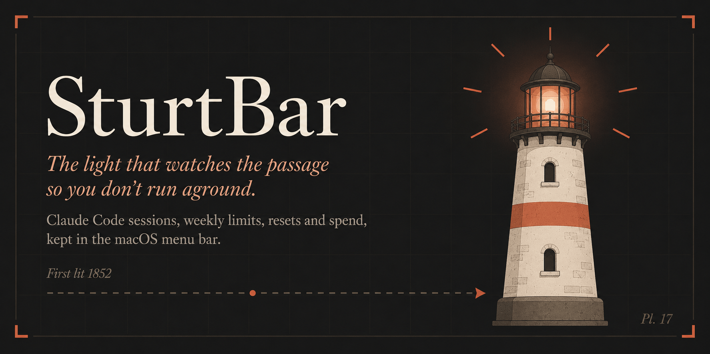

# SturtBar

[](https://github.com/michael-palmes/SturtBar/actions/workflows/ci.yml)
[](https://github.com/michael-palmes/SturtBar/releases/latest)
[](LICENSE)

**The light that watches the passage so you don't run aground.**

SturtBar is a small, calm macOS menu bar app that keeps watch over your Claude Code usage: how much of the current session window is left, how much of the week, when each one resets, and what you have spent. Usage limits are the rocks. Your remaining quota is your sea room. SturtBar keeps the light burning so you always know how much passage you have left.

It is named for the Sturt Light at Cape Willoughby, on the eastern tip of Kangaroo Island: South Australia's first lighthouse, first lit on 16 January 1852, watching over Backstairs Passage so ships did not run aground. The light's namesake, as Colonial Secretary, raised the money from shipping interests to build the very light that warned their ships off the rocks. The funder paid for the warning. SturtBar is that light, re-manned by software.

> Note: SturtBar is an independent project. It is not affiliated with, endorsed by, or built by Anthropic. It reads the usage data Claude Code already stores on your Mac.

## What it shows

- **The Lamp** (the menu bar glyph): a two-bar meter. The tall bar is the session window, the short bar is the week. Each fills from the bottom as usage rises.
- **The Logbook** (the popover): session and weekly windows with exact percentages and reset countdowns, plus your spend for the period.
- **Notices to Mariners**: a rare, useful notification at 75% of a session, at the limit, when it refloats, and as the week draws in. Each is individually toggleable. No streaks, no nags, no re-engagement. A lighthouse does not send push notifications asking if you have thought about it lately.

## How it works

SturtBar reads the credentials Claude Code already keeps on your Mac. It looks first at `~/.claude/.credentials.json`, then falls back to the `Claude Code-credentials` item in your login keychain. It uses those credentials to call the usage API, exactly as Claude Code does.

Spend is read locally by scanning the session logs under `~/.claude/projects` (the same JSONL `ccusage` reads). Nothing is uploaded.

Refresh runs on a hybrid schedule: whenever you open the menu, plus a background interval you choose (manual, 1, 2, 5, 15, or 30 minutes; 5 is the default). Cost scans run on demand.

**On token rotation:** if SturtBar ever has to refresh an expired OAuth token, the rotated token is written **only** to SturtBar's own keychain cache. SturtBar never writes to Claude Code's credential stores.

## Privacy

Everything stays on your Mac. The only network calls SturtBar makes are to the usage API (to read your numbers) and to `models.dev` (to keep its pricing table current). There is no analytics, no telemetry, and no account of any kind with SturtBar.

## Requirements

- macOS 26 or later
- Claude Code installed and signed in (run `claude` once so the credentials exist)

## Install

Download the latest notarised `SturtBar-<version>.dmg` from the [Releases](https://github.com/michael-palmes/SturtBar/releases) page. Open it and drag **SturtBar** onto the **Applications** folder, following the chart. Eject the disk image when you're done. SturtBar lives in the menu bar; it has no Dock icon.

(A `.zip` of the app is also attached for scripted installs.)

## Build from source

Zero third-party dependencies; the system toolchain is all you need.

```sh
make build      # swift build
make test       # swift test
make run        # build, package, and launch a local dev build
make package    # assemble dist/SturtBar.app
make dmg        # build a local unsigned DMG installer for preview
make lint       # SwiftFormat + SwiftLint
```

## Credits

The idea was sparked by [CodexBar](https://github.com/steipete/CodexBar) by Peter Steinberger. SturtBar is a lighter, faster, more privacy focused take on it: one provider instead of many, zero third-party dependencies, and nothing that leaves your Mac. Thanks for the spark.

## License

MIT. See [LICENSE](LICENSE).
